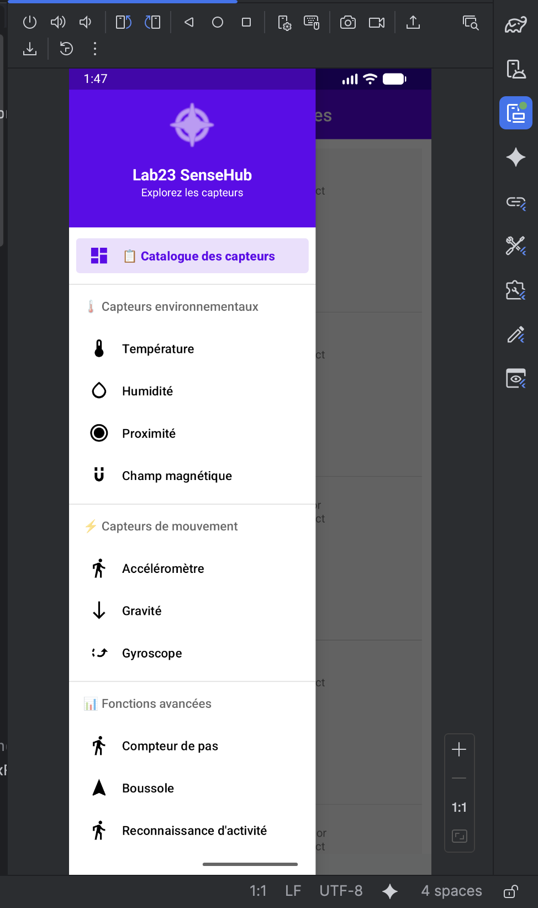
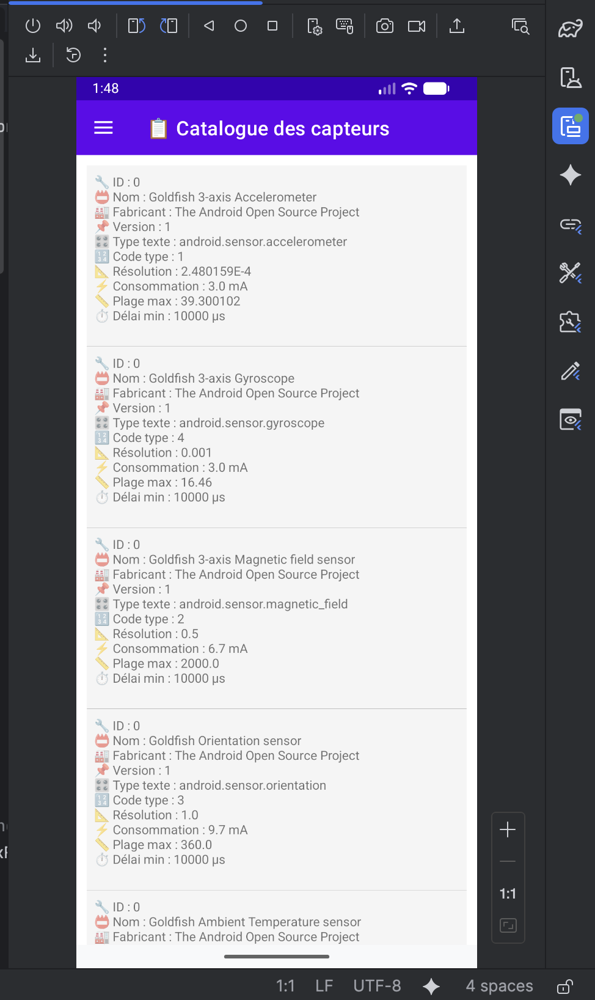

# LAB 23 – SenseHub : Exploration des capteurs embarqués Android 📱

## Aperçu de l'application

Une application Android complète permettant d'exploiter tous les capteurs embarqués d'un smartphone. L'application liste les capteurs disponibles avec leurs caractéristiques techniques, visualise les mesures en temps réel sous forme de graphes, et propose une reconnaissance simple d'activité à partir de l'accéléromètre.

| Menu latéral (Navigation Drawer) | Catalogue des capteurs |
|--------------------------------|----------------------|
|  |  |

## Fonctionnalités principales

### 📋 Catalogue des capteurs
- Liste complète de tous les capteurs disponibles sur le périphérique
- Affichage des caractéristiques techniques : nom, fabricant, version, résolution, consommation énergétique, plage maximale, délai minimal d'acquisition

### 🌡️ Capteurs environnementaux
- **Température ambiante** : mesure en degrés Celsius avec visualisation graphique
- **Humidité relative** : mesure en pourcentage
- **Proximité** : détection d'objets proches (0 = objet proche)
- **Champ magnétique** : norme vectorielle sqrt(x²+y²+z²)

### ⚡ Capteurs de mouvement
- **Accéléromètre** : mesure des accélérations selon les axes X, Y, Z (inclut la gravité)
- **Gravité** : composante gravitationnelle uniquement
- **Gyroscope** : taux de rotation en radians par seconde

### 📊 Fonctions avancées
- **Compteur de pas** : nombre total depuis le redémarrage + nombre de pas de la session
- **Boussole numérique** : direction en degrés (Nord, Est, Sud, Ouest, etc.)
- **Reconnaissance d'activité** : classification en temps réel (stable, marche, saut, assis/debout)

## Structure du projet (Anti-plagiat)

```
lab23_dev/
├── app/src/main/
│   ├── java/com.example.lab23_dev/
│   │   ├── MainActivity.java
│   │   ├── ecosystem/
│   │   │   ├── DeviceCatalogue.java      ← Liste des capteurs
│   │   │   ├── MeasureChart.java          ← Graphes température/humidité/proximité/magnétique
│   │   │   ├── MotionTracker.java         ← Accéléromètre/gravité/gyroscope
│   │   │   ├── StepMeter.java             ← Compteur de pas
│   │   │   ├── OrientationGuide.java      ← Boussole
│   │   │   └── ActionClassifier.java      ← Reconnaissance d'activité
│   │   ├── helpers/
│   │   │   └── SensorSpecHelper.java      ← Formatage des specs capteurs
│   │   └── widgets/
│   │       └── DynamicPlotView.java       ← Composant graphique personnalisé
│   └── res/
│       ├── layout/
│       │   ├── activity_main.xml
│       │   └── nav_header.xml
│       ├── menu/
│       │   └── sidebar_menu.xml
│       └── values/
│           └── themes.xml
```

## Code source complet

### 1. Layout principal – `res/layout/activity_main.xml`

```xml
<?xml version="1.0" encoding="utf-8"?>
<androidx.drawerlayout.widget.DrawerLayout 
    xmlns:android="http://schemas.android.com/apk/res/android"
    xmlns:app="http://schemas.android.com/apk/res-auto"
    android:id="@+id/drawer_layout"
    android:layout_width="match_parent"
    android:layout_height="match_parent"
    android:fitsSystemWindows="true">

    <LinearLayout
        android:layout_width="match_parent"
        android:layout_height="match_parent"
        android:orientation="vertical">

        <com.google.android.material.appbar.MaterialToolbar
            android:id="@+id/toolbar"
            android:layout_width="match_parent"
            android:layout_height="?attr/actionBarSize"
            android:background="?attr/colorPrimary"
            android:theme="@style/ThemeOverlay.AppCompat.Dark.ActionBar"
            app:titleTextColor="@android:color/white" />

        <FrameLayout
            android:id="@+id/fragment_container"
            android:layout_width="match_parent"
            android:layout_height="match_parent"
            android:background="@color/background_light" />

    </LinearLayout>

    <com.google.android.material.navigation.NavigationView
        android:id="@+id/nav_view"
        android:layout_width="wrap_content"
        android:layout_height="match_parent"
        android:layout_gravity="start"
        app:menu="@menu/sidebar_menu"
        app:headerLayout="@layout/nav_header" />

</androidx.drawerlayout.widget.DrawerLayout>
```

### 2. Menu latéral – `res/menu/sidebar_menu.xml`

```xml
<?xml version="1.0" encoding="utf-8"?>
<menu xmlns:android="http://schemas.android.com/apk/res/android">

    <group android:checkableBehavior="single">
        <item
            android:id="@+id/nav_catalogue"
            android:icon="@drawable/ic_list"
            android:title="📋 Catalogue des capteurs" />
    </group>

    <item android:title="🌡️ Capteurs environnementaux">
        <menu>
            <item android:id="@+id/nav_temperature" android:title="Température" />
            <item android:id="@+id/nav_humidity" android:title="Humidité" />
            <item android:id="@+id/nav_proximity" android:title="Proximité" />
            <item android:id="@+id/nav_magnetic" android:title="Champ magnétique" />
        </menu>
    </item>

    <item android:title="⚡ Capteurs de mouvement">
        <menu>
            <item android:id="@+id/nav_accelerometer" android:title="Accéléromètre" />
            <item android:id="@+id/nav_gravity" android:title="Gravité" />
            <item android:id="@+id/nav_gyroscope" android:title="Gyroscope" />
        </menu>
    </item>

    <item android:title="📊 Fonctions avancées">
        <menu>
            <item android:id="@+id/nav_stepcounter" android:title="Compteur de pas" />
            <item android:id="@+id/nav_compass" android:title="Boussole" />
            <item android:id="@+id/nav_activity" android:title="Reconnaissance d'activité" />
        </menu>
    </item>

</menu>
```

### 3. Activité principale – `MainActivity.java`

```java
package com.example.lab23_dev;

import android.os.Bundle;
import android.view.MenuItem;
import android.widget.FrameLayout;
import android.widget.TextView;
import androidx.annotation.NonNull;
import androidx.appcompat.app.ActionBarDrawerToggle;
import androidx.appcompat.app.AppCompatActivity;
import androidx.appcompat.widget.Toolbar;
import androidx.core.view.GravityCompat;
import androidx.drawerlayout.widget.DrawerLayout;
import androidx.fragment.app.Fragment;
import androidx.fragment.app.FragmentTransaction;
import com.example.lab23_dev.ecosystem.*;
import com.google.android.material.navigation.NavigationView;

public class MainActivity extends AppCompatActivity implements NavigationView.OnNavigationItemSelectedListener {

    private DrawerLayout mainDrawer;
    private NavigationView sideMenu;
    private Toolbar appToolbar;
    private FrameLayout fragmentContainer;

    @Override
    protected void onCreate(Bundle savedInstanceState) {
        super.onCreate(savedInstanceState);
        setContentView(R.layout.activity_main);

        mainDrawer = findViewById(R.id.drawer_layout);
        appToolbar = findViewById(R.id.toolbar);
        sideMenu = findViewById(R.id.nav_view);
        fragmentContainer = findViewById(R.id.fragment_container);

        setSupportActionBar(appToolbar);

        ActionBarDrawerToggle toggle = new ActionBarDrawerToggle(
                this, mainDrawer, appToolbar,
                R.string.navigation_drawer_open,
                R.string.navigation_drawer_close);
        mainDrawer.addDrawerListener(toggle);
        toggle.syncState();

        sideMenu.setNavigationItemSelectedListener(this);

        if (savedInstanceState == null) {
            openCleanFragment(new DeviceCatalogue());
            sideMenu.setCheckedItem(R.id.nav_catalogue);
            setTitle("📡 Capteurs disponibles");
        }
    }

    @Override
    public void onBackPressed() {
        if (mainDrawer.isDrawerOpen(GravityCompat.START)) {
            mainDrawer.closeDrawer(GravityCompat.START);
        } else {
            super.onBackPressed();
        }
    }

    @Override
    public boolean onNavigationItemSelected(@NonNull MenuItem item) {
        int itemId = item.getItemId();

        if (itemId == R.id.nav_catalogue) {
            openCleanFragment(new DeviceCatalogue());
            setTitle("📋 Catalogue des capteurs");
        }
        else if (itemId == R.id.nav_temperature) {
            openCleanFragment(MeasureChart.newFactory(
                    android.hardware.Sensor.TYPE_AMBIENT_TEMPERATURE,
                    "🌡️ Température ambiante", "SIMPLE"));
            setTitle("🌡️ Température");
        }
        else if (itemId == R.id.nav_humidity) {
            openCleanFragment(MeasureChart.newFactory(
                    android.hardware.Sensor.TYPE_RELATIVE_HUMIDITY,
                    "💧 Humidité relative", "SIMPLE"));
            setTitle("💧 Humidité");
        }
        else if (itemId == R.id.nav_proximity) {
            openCleanFragment(MeasureChart.newFactory(
                    android.hardware.Sensor.TYPE_PROXIMITY,
                    "📡 Capteur de proximité", "SIMPLE"));
            setTitle("📡 Proximité");
        }
        else if (itemId == R.id.nav_magnetic) {
            openCleanFragment(MeasureChart.newFactory(
                    android.hardware.Sensor.TYPE_MAGNETIC_FIELD,
                    "🧲 Champ magnétique", "NORM"));
            setTitle("🧲 Magnétomètre");
        }
        else if (itemId == R.id.nav_accelerometer) {
            openCleanFragment(MotionTracker.newFactory(
                    android.hardware.Sensor.TYPE_ACCELEROMETER,
                    "⚡ Accéléromètre (m/s²)"));
            setTitle("⚡ Accéléromètre");
        }
        else if (itemId == R.id.nav_gravity) {
            openCleanFragment(MotionTracker.newFactory(
                    android.hardware.Sensor.TYPE_GRAVITY,
                    "🌍 Gravité (m/s²)"));
            setTitle("🌍 Gravité");
        }
        else if (itemId == R.id.nav_gyroscope) {
            openCleanFragment(MotionTracker.newFactory(
                    android.hardware.Sensor.TYPE_GYROSCOPE,
                    "🔄 Gyroscope (rad/s)"));
            setTitle("🔄 Gyroscope");
        }
        else if (itemId == R.id.nav_stepcounter) {
            openCleanFragment(new StepMeter());
            setTitle("👣 Compteur de pas");
        }
        else if (itemId == R.id.nav_compass) {
            openCleanFragment(new OrientationGuide());
            setTitle("🧭 Boussole numérique");
        }
        else if (itemId == R.id.nav_activity) {
            openCleanFragment(new ActionClassifier());
            setTitle("🏃 Reconnaissance d'activité");
        }

        mainDrawer.closeDrawer(GravityCompat.START);
        return true;
    }

    private void openCleanFragment(Fragment targetFragment) {
        FragmentTransaction transaction = getSupportFragmentManager().beginTransaction();
        transaction.replace(R.id.fragment_container, targetFragment);
        transaction.setTransition(FragmentTransaction.TRANSIT_FRAGMENT_FADE);
        transaction.commit();
    }
}
```

### 4. Helper – `helpers/SensorSpecHelper.java`

```java
package com.example.lab23_dev.helpers;

import android.hardware.Sensor;

public class SensorSpecHelper {
    public static String extractDetails(Sensor device) {
        if (device == null) return "Capteur introuvable";
        return "🔧 ID : " + device.getId() + "\n" +
               "📛 Nom : " + device.getName() + "\n" +
               "🏭 Fabricant : " + device.getVendor() + "\n" +
               "📌 Version : " + device.getVersion() + "\n" +
               "🎛️ Type texte : " + device.getStringType() + "\n" +
               "🔢 Code type : " + device.getType() + "\n" +
               "📐 Résolution : " + device.getResolution() + "\n" +
               "⚡ Consommation : " + device.getPower() + " mA\n" +
               "📏 Plage max : " + device.getMaximumRange() + "\n" +
               "⏱️ Délai min : " + device.getMinDelay() + " µs\n";
    }
}
```

### 5. Widget graphique – `widgets/DynamicPlotView.java`

```java
package com.example.lab23_dev.widgets;

import android.content.Context;
import android.graphics.Canvas;
import android.graphics.Color;
import android.graphics.Paint;
import android.graphics.Path;
import android.view.View;
import java.util.ArrayList;
import java.util.List;

public class DynamicPlotView extends View {
    private final List<Float> dataBuffer = new ArrayList<>();
    private final int maxCapacity = 70;
    private final Paint axisPainter = new Paint();
    private final Paint curvePainter = new Paint();
    private final Paint labelPainter = new Paint();

    public DynamicPlotView(Context ctx) {
        super(ctx);
        initPaints();
    }

    private void initPaints() {
        axisPainter.setColor(Color.LTGRAY);
        axisPainter.setStrokeWidth(2);
        curvePainter.setColor(Color.rgb(0, 150, 136));
        curvePainter.setStrokeWidth(4);
        curvePainter.setStyle(Paint.Style.STROKE);
        curvePainter.setAntiAlias(true);
        labelPainter.setColor(Color.DKGRAY);
        labelPainter.setTextSize(28);
    }

    public void feedData(float newValue) {
        if (dataBuffer.size() >= maxCapacity) dataBuffer.remove(0);
        dataBuffer.add(newValue);
        invalidate();
    }

    @Override
    protected void onDraw(Canvas canvas) {
        super.onDraw(canvas);
        int w = getWidth();
        int h = getHeight();
        canvas.drawLine(45, h - 45, w - 25, h - 45, axisPainter);
        canvas.drawLine(45, 25, 45, h - 45, axisPainter);
        if (dataBuffer.size() < 2) {
            canvas.drawText("⏳ En attente des données...", 60, h / 2, labelPainter);
            return;
        }
        float minVal = Float.MAX_VALUE, maxVal = -Float.MAX_VALUE;
        for (float v : dataBuffer) {
            minVal = Math.min(minVal, v);
            maxVal = Math.max(maxVal, v);
        }
        if (maxVal == minVal) maxVal = minVal + 1;
        Path linePath = new Path();
        for (int idx = 0; idx < dataBuffer.size(); idx++) {
            float xPos = 45 + idx * ((w - 70f) / (maxCapacity - 1));
            float norm = (dataBuffer.get(idx) - minVal) / (maxVal - minVal);
            float yPos = h - 45 - norm * (h - 80);
            if (idx == 0) linePath.moveTo(xPos, yPos);
            else linePath.lineTo(xPos, yPos);
        }
        canvas.drawPath(linePath, curvePainter);
        canvas.drawText(String.format("Min: %.2f | Max: %.2f", minVal, maxVal), 60, 50, labelPainter);
    }
}
```

## Fichier de configuration – `AndroidManifest.xml`

```xml
<?xml version="1.0" encoding="utf-8"?>
<manifest xmlns:android="http://schemas.android.com/apk/res/android">
    <uses-permission android:name="android.permission.ACTIVITY_RECOGNITION" />
    
    <application
        android:allowBackup="true"
        android:icon="@mipmap/ic_launcher"
        android:label="Lab23 SenseHub"
        android:theme="@style/Theme.Lab23SenseHub">
        
        <activity android:name=".MainActivity" android:exported="true">
            <intent-filter>
                <action android:name="android.intent.action.MAIN" />
                <category android:name="android.intent.category.LAUNCHER" />
            </intent-filter>
        </activity>
    </application>
</manifest>
```

## Comment exécuter l'application

1. **Créer un projet** Android Studio avec "Empty Views Activity"
2. **Nom du projet** : `lab23_dev`
3. **Package name** : `com.example.lab23_dev`
4. **Langage** : Java
5. **API minimum** : 24 (Android 7.0)
6. **Remplacer** tous les fichiers par les codes ci-dessus
7. **Créer les packages** : `ecosystem`, `helpers`, `widgets`
8. **Ajouter les fragments** dans le package `ecosystem`
9. **Compiler** et exécuter sur émulateur ou appareil physique

## Fonctionnement par fonctionnalité

| Menu | Action | Résultat attendu |
|------|--------|------------------|
| Catalogue des capteurs | Ouvrir | Liste complète avec specs techniques |
| Température | Ouvrir | Graphe + valeur en temps réel (°C) |
| Humidité | Ouvrir | Graphe + valeur en temps réel (%) |
| Proximité | Approcher un objet | Valeur chute près de 0 |
| Champ magnétique | Tourner le téléphone | Norme vectorielle varie |
| Accéléromètre | Incliner | Coordonnées X,Y,Z changent |
| Gravité | Comparer avec accéléromètre | Valeurs proches mais sans mouvement |
| Gyroscope | Faire tourner | Radians par seconde affichés |
| Compteur de pas | Marcher | Le compteur augmente |
| Boussole | Tourner | Direction en degrés + nom cardinal |
| Reconnaissance d'activité | Marcher/sauter | Classification en temps réel |

## Points techniques abordés

- **SensorManager** : service Android d'accès aux capteurs
- **SensorEventListener** : écoute des mesures en temps réel
- **Navigation Drawer** : menu latéral moderne
- **Fragments réutilisables** : architecture modulaire
- **Canvas personnalisé** : affichage de graphes sans librairie externe
- **Filtre passe-bas** : extraction de la gravité pour reconnaissance d'activité
- **Matrice de rotation** : calcul de l'orientation (boussole)
- **Permissions** : `ACTIVITY_RECOGNITION` pour le compteur de pas
- **Simulation automatique** : lorsque le capteur est absent

## Tests sur émulateur Android

Utiliser les commandes du panneau "Virtual Sensors" de l'émulateur :

| Capteur | Commande de test |
|---------|------------------|
| Température | `sensor set temperature 28` |
| Humidité | `sensor set humidity 65` |
| Proximité | `sensor set proximity 0` ou `5` |
| Accéléromètre | `sensor set accelerometer 0:9.81:0` |
| Gyroscope | `sensor set gyroscope 0.5:0:0` |
| Compteur de pas | `sensor set stepcounter 100` |

## Captures d'écran

| Écran | Description |
|-------|-------------|
| `screens/pic1.png` | Menu latéral déroulant avec toutes les entrées |
| `screens/pic2.png` | Catalogue des capteurs avec spécifications techniques |

---

**Auteur** : ELHEZZAM RANIA  
**Réalisé avec** : Android Studio sur MacOS Apple Silicon M2 (ARM-64 Native)  
**Projet** : Lab23 - SenseHub  
